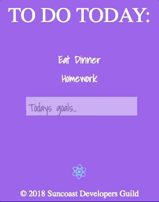

## Summary

In this assignment we were instructed to build a classic to-do list. I found this to be a good practice to sharpen my skills and expand my knowledge fetching data.

## Things Learned

Fetching data from API with axios and navigating through response data:

- Get
- Post
- Put
- Delete

## Technologies Used

- Javascript - https://www.javascript.com/
- REACT - https://reactjs.org/
- CSS
- HTML
